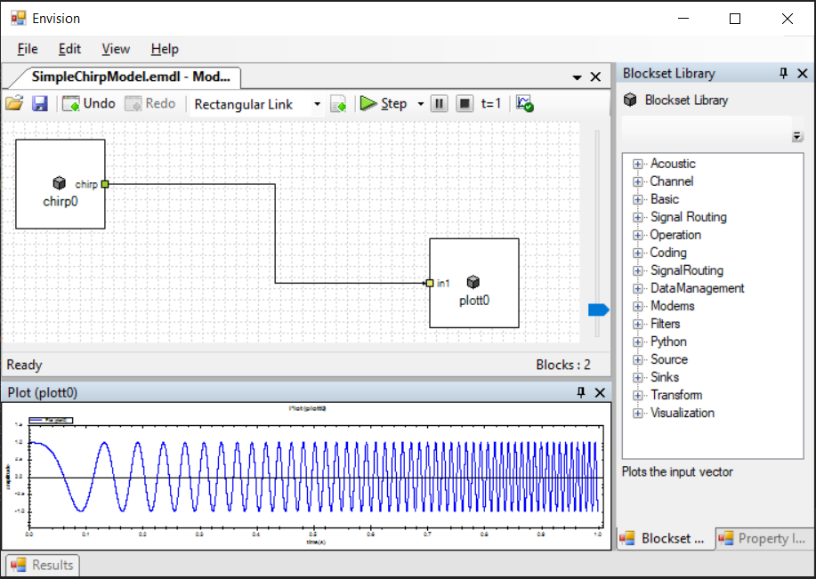
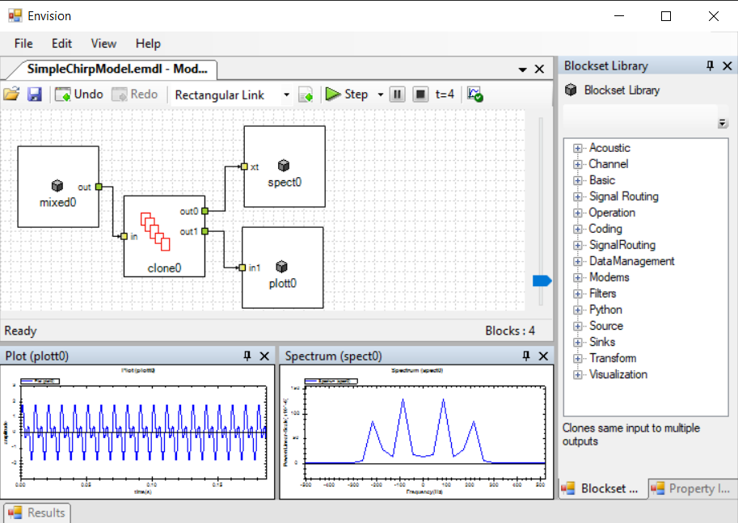
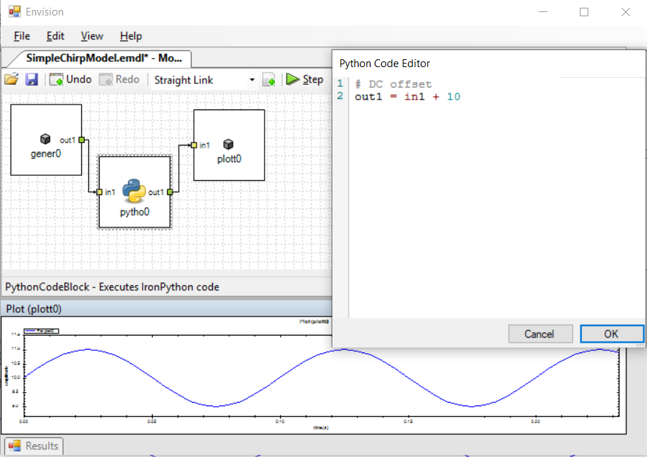

# Envision

> **This software is not maintained**. I built Envision and last worked on
> it during my engineering (2016) for acoustic communication research for
> underwater applications and have not worked on it since. I don't know if the
> code in this repository will even build anymore. 😂

Envision is a Dynamic Systems Simulator (similar to Simulink) written in C#.

## Features

* Block diagram based model design.
* Built-in toolbox with facilities for:
  * Signal generation (Digital, Analog, Noise)
  * Visualization (Time Plotting + Spectrum)
  * Basic Arithmetic operations
* [LiquidDSP](https://github.com/jgaeddert/liquid-dsp/) integration, which enables:
  * Complex signal operations such as FFT/iFFT
  * FIR & IIR filters with filter designer for Butterworth, Chebyshev, Bessel etc.
  * Over 10 (PSK, ASK, DPSK, QPSK, ARB etc.) Modulation/Demodulation methods with
    their 8, 16, upto 256 bit variations.
* Signal sinks to write simulation results to file or to even play it using audio
  output H/W (e.g., speaker) on the host.
* **[IronPython](https://ironpython.net/)** integration to enable writing custom simulation components.
  * Envision can load python files at startup and expose python functions as blocks.
  * Also has a `Python` block with syntax highlighting editor which enables writing
    python scripts directly within the model editor.
* Block interface which can be implemented and added as extension to Envision through
  external DLL files built using any .NET Runtime compatible languages (C#, VB .NET etc.)

## Screenshots

